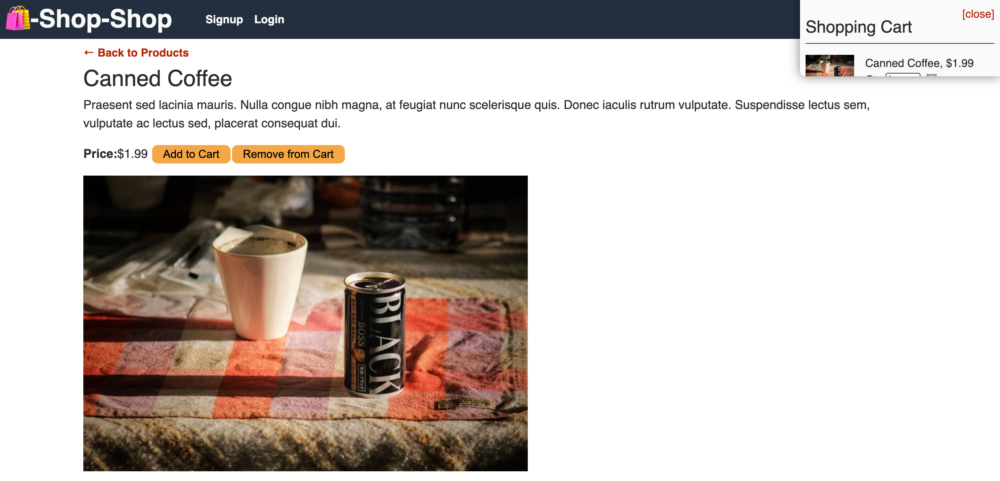
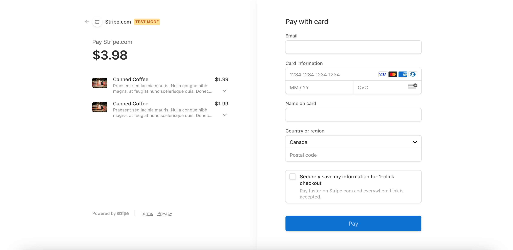

# shop-redux-store

Shop Shop Redux is an online shopping platform where you can acquire various products and conveniently complete your transactions through Stripe integration. This platform represents a revamped version of the initial [Shop-Shop](https://github.com/thekhyatigandhi/shop-redux-store), which previously relied on React's Context API for managing global state. In contrast, Shop Shop Redux leverages the Redux library to effectively manage the global state of the application.

- [Application](#Application)
- [Technologies Used](#TechnologiesUsed)
- [Installation](#Installation)
- [Credits](#credits)
- [License](#license)

## Application

Sort by categories such as Food, Household Supplies, Electronics, Books, and Toys (as pictured below) while you shop.

### Homepage

Displays all the products


### Shopping Cart

Easy access to your shopping cart as you add items. You can adjust product quantity and remove items.
The checkout option is only available when you are signed in.


### Stripe/Checkout

The Shop Shop uses stripe as a simple and secure way to complete order payments. You can test out the functionality by using a fake
credit card number `1234 5678 9010`. The rest of the payment info can be anything.


## Technologies Used

- MongoDB
- Express.js
- React.js
- Node.js
- Stripe
- Redux

## Installation

-To access the project without any installation, simply visit the [deployed Heroku link](https://khyati-book-search-8e10207ee80d.herokuapp.com/)

-To run the Shop Redux Store on your local machine, follow these steps:
Start with installing the dependencies:

```
npm install
```

Once the dependencies are installed,

```
npm run seed
```

and then

```
npm run develop
```

By following these steps, you can run the project locally and have full control over its functionality.

## Credits

https://nodejs.org/en </br>
https://www.mongodb.com/</br>

## License

MIT License.
For more information on the license, please refer to the LICENSE file in the repo
